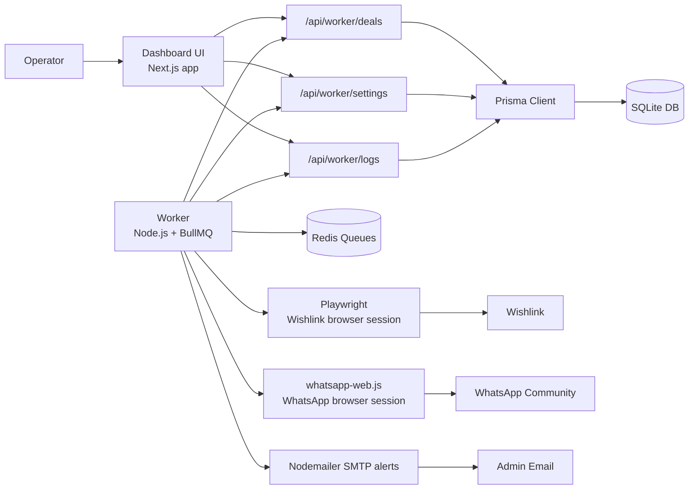
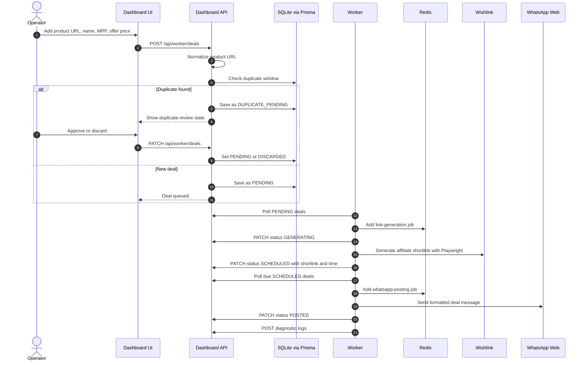
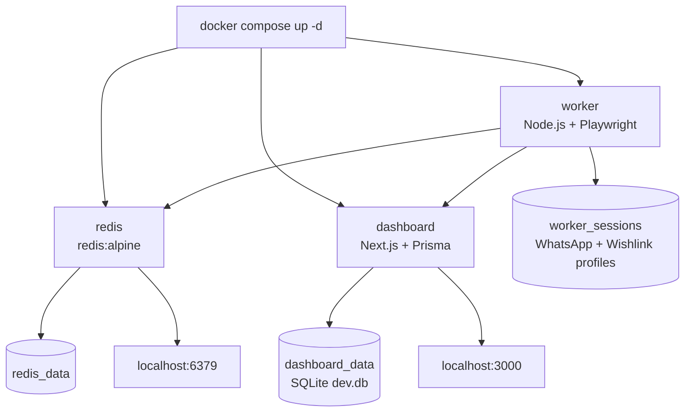
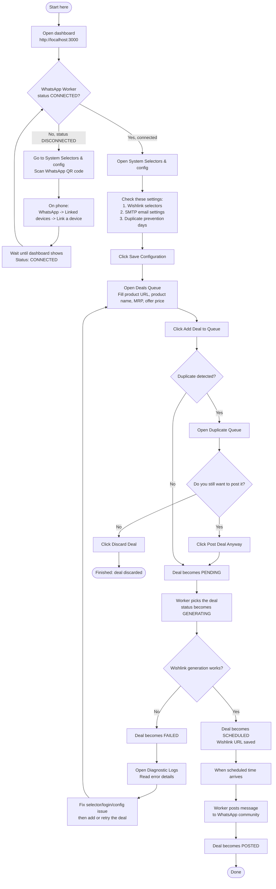
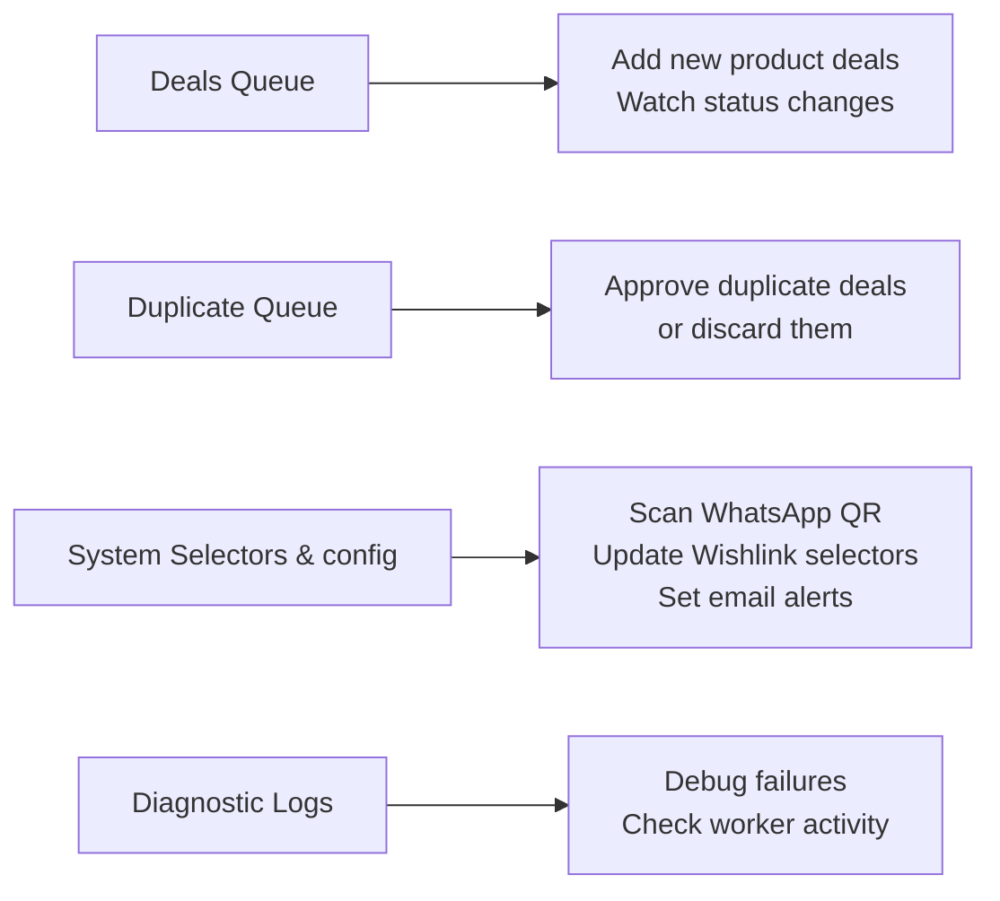
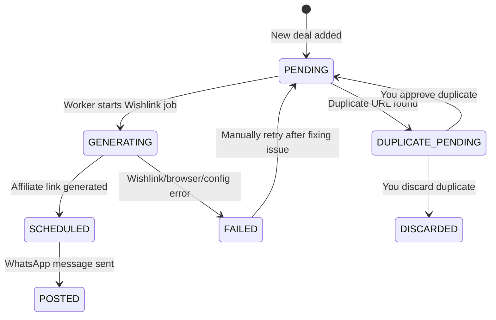

# Meesho Automation

Automation workspace for collecting Meesho/Amazon deals, generating Wishlink affiliate links, and posting scheduled messages to WhatsApp.

## Project Structure

```text
apps/dashboard   Next.js dashboard, API routes, Prisma SQLite database
apps/worker      Background worker for Redis queues, WhatsApp, Playwright/Wishlink
packages/shared  Shared types and URL helpers
```

## System Design



## Deal Workflow



## Docker Runtime



## Install

```bash
npm install
```

## Environment

This repo includes local `.env` files and commit-safe `.env.example` templates:

```text
.env                         Docker Compose values
.env.example                 Docker Compose template
apps/dashboard/.env          Dashboard local database config
apps/dashboard/.env.example  Dashboard template
apps/worker/.env             Worker local Redis/API/browser config
apps/worker/.env.example     Worker template
```

Create or reset local env files from examples:

```bash
cp .env.example .env
cp apps/dashboard/.env.example apps/dashboard/.env
cp apps/worker/.env.example apps/worker/.env
```

Dashboard local env file:

```bash
apps/dashboard/.env
```

Minimum local value:

```env
DATABASE_URL="file:./dev.db"
PORT=3000
```

Worker env values can be provided in your shell or Docker Compose:

```env
REDIS_HOST=localhost
REDIS_PORT=6379
DASHBOARD_URL=http://localhost:3000
WHATSAPP_COMMUNITY_NAME="My Deals Community"
WHATSAPP_SESSION_PATH=apps/worker/.wwebjs_auth
WISHLINK_USER_DATA_DIR=apps/worker/.wishlink_session
```

## Local Development

Start Redis only:

```bash
docker compose up -d redis
```

Generate Prisma client:

```bash
npm run db:generate
```

Sync SQLite schema without migrations:

```bash
npm run db:push
```

Start dashboard:

```bash
npm run dev:dashboard
```

Start worker in another terminal:

```bash
npm run dev:worker
```

If the worker cannot find Chrome/Chromium locally, install Playwright's Chromium:

```bash
npm run browser:install
```

Open:

```text
http://localhost:3000
```

## Docker

Build all services:

```bash
docker compose build
```

Start full stack:

```bash
docker compose up -d
```

Check status:

```bash
docker compose ps
```

View logs:

```bash
docker compose logs -f dashboard
docker compose logs -f worker
docker compose logs -f redis
```

Stop services:

```bash
docker compose down
```

Stop services and remove named volumes/data:

```bash
docker compose down -v
```

The dashboard container stores SQLite data in the `dashboard_data` volume. The worker stores WhatsApp and Wishlink browser sessions in the `worker_sessions` volume.

## Database Commands

Generate Prisma client:

```bash
npm run db:generate
```

Push schema directly to SQLite:

```bash
npm run db:push
```

Create and apply a development migration:

```bash
npm run db:migrate -- --name init
```

Apply existing migrations in production/CI:

```bash
npm run db:migrate:deploy
```

Open Prisma Studio:

```bash
npm run db:studio
```

Run Prisma commands directly in the dashboard workspace:

```bash
npm run db:generate --workspace=apps/dashboard
npm run db:push --workspace=apps/dashboard
npm run db:migrate --workspace=apps/dashboard -- --name your_migration_name
npm run db:migrate:deploy --workspace=apps/dashboard
npm run db:studio --workspace=apps/dashboard
```

## Build And Start

Build dashboard:

```bash
npm run build:dashboard
```

Build worker:

```bash
npm run build:worker
```

Install local Chromium for WhatsApp/Playwright automation:

```bash
npm run browser:install
```

Start production dashboard locally:

```bash
npm run start:dashboard
```

Start production worker locally:

```bash
npm run start:worker
```

## Quality Checks

Lint dashboard:

```bash
npm run lint:dashboard
```

Run both builds:

```bash
npm run build:dashboard
npm run build:worker
```

## Useful API Checks

Dashboard settings:

```bash
curl http://localhost:3000/api/worker/settings
```

Deals:

```bash
curl http://localhost:3000/api/worker/deals
```

Logs:

```bash
curl "http://localhost:3000/api/worker/logs?limit=50"
```

Create a test deal:

```bash
curl -X POST http://localhost:3000/api/worker/deals \
  -H "Content-Type: application/json" \
  -d '{
    "externalUrl": "https://www.meesho.com/example/p/123",
    "productName": "Test Product",
    "mrp": 999,
    "offerPrice": 499
  }'
```

## WhatsApp Setup

After starting the worker, scan the QR code shown in:

```bash
docker compose logs -f worker
```

The dashboard also exposes the latest QR through the settings API and UI.

## Beginner Usage Guide

Use this flow after the dashboard and worker are running.



### What Each Tab Is For



### Status Meaning



## Common Fixes

If `@prisma/client did not initialize yet` appears:

```bash
npm run db:generate
```

If the local database schema is missing tables:

```bash
npm run db:push
```

If the worker says `Browser was not found at the configured executablePath`:

```bash
npm run browser:install
```

Or use an installed Chrome manually:

```bash
CHROME_EXECUTABLE_PATH="/Applications/Google Chrome.app/Contents/MacOS/Google Chrome" npm run dev:worker
```

If Docker services are using stale images:

```bash
docker compose build --no-cache
docker compose up -d
```
